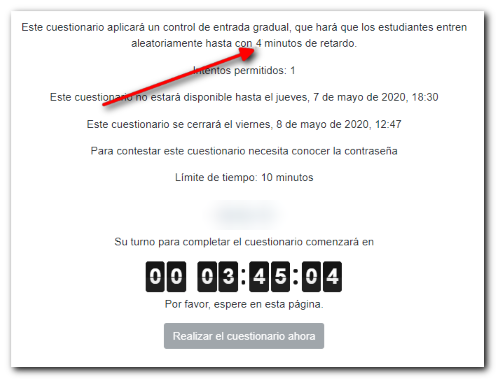
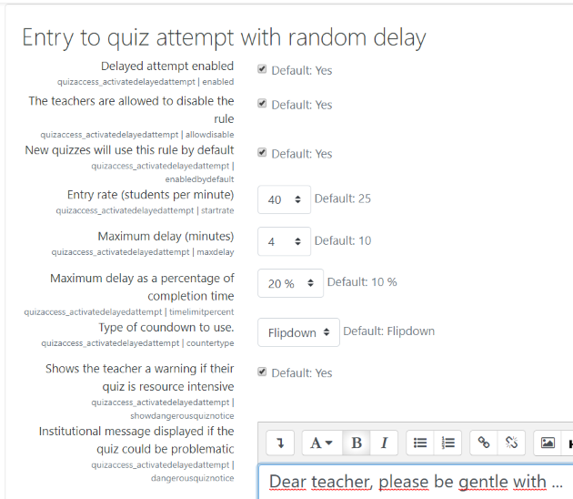

# Quiz Access Rule quizaccess_delayed
Auto Activate the Quiz Attempt Button with a randomized delay to reduce the load at the start of the quizes.

There is a tutorial page at https://juacas.github.io/quizaccess_delayed/index.html

## Background and Need

1) In a quiz with strict time constraints students tend to refresh the page too often, just to make sure if the attempt is available yet.
2) This unnecessarily increases the server load, and is a problem with large number of students.
3) Synchronized start of many attempts places a heavy short-time load in the Quiz core engine. By phasing in access, the impact is minimized.
4) Some questionnaire configurations generate particularly high server loads.
5) Some quiz schedules generate problems for students.

## Solution

The “Activate Delayed Attempt” plugin makes the “Attempt quiz now” button auto-enable at quiz open timing plus a randomized delay, without requiring to refresh the page.
This is done by a client side countdown timer (javascript) which is initiated when the page is rendered in the browser.

The plugin is implemented as an access-rule plugin overriding the default activity page render.
The page, displays the time remaining to start the quiz using an animated countdown.
A pseudo-random delay is assigned to each student depending on the number of students and a set of site-wide parameters as fixed rate of entry, maximum allowable delay.
An optional message for the students can be defined for all quizzes in the platform.
An optional check and advice message for teachers can be defined for all quizzes in the platform.

## How the delay is calculated
- The plugin acts only until the instant of the start of the quiz plus the number of minutes of maximum delay. After that it doesn't work anymore because the critical moment of the start is supposed to be over.
- The maximum delay is calculated as follows:
  - Number of students divided by the entry rate specified by the administrator. E.g. with 25 students/minute, if the course has 200 students, the maximum delay will be 8 minutes.
  - Maximum of 10% of the test duration. We have considered that it is not logical to wait 4 minutes for a 15-minute exam. E.g. 15 minute exam => maximum wait of 1.5 minutes.
  - Maximum time limit defined by the administrator. This is to put a reasonable limit in the case of large groups at the cost of suffering a higher entry fee. E.g. maximum 4 minutes.
  - At least 1 minute. This is to ensure that there is always gradual access. With 1 minute, students do not notice the delay because it is in the range of accuracy of the usual clock.
- With all these limitations, the final entry rate is the one needed to meet all specifications. In this example it would be 200 students/1.5 minutes = 133 students/minute (about 2 per second). If we want to spit out the input rate we will have to give up the absolute limit or the percentage of the completion time. In the UVa we have decided that a long delay is not functionally admissible in the case of short exams, because it would make some students almost finish and others would still be starting.

## How a quiz is marked as "resource-intensive" or "problematic"

In our experience, a mass quiz is "resource-intensive" aka "problematic" when it meets these characteristics:
- It's paged so that each page will last less than 10 minutes.
- The time allotted is too tight.
- The entry rate of students is too high.

The time alloted is considered too tight if
- The total time allotted is less than:
  - the completion time plus the gradual entry delay plus 10% of the completion time. (An opening of the activity of less than this time does not allow to face the small incidences of any test.)
  - not excess a 20% of the execution time.

## Releases
- v1.2.2 Use Gulp and Babel for IExplorer compatibility.
- v1.2.1 Place advices for the teacher for quizzes that are resource intensives of potentially problematic.
- v1.2.0 Rule can be enabled/disabled in each instance.
- v1.1.1b Management controls in system settings.
- v1.1.1 Animated countdown.
- v1.1.0 Textual countdowmn.

## Installation

1) Unzip it into /mod/quiz/accessrule/delayed
2) Log in into Moodle
3) A notification will appear stating “Plugins requiring attention”.
4) Complete the installation by clicking on “Upgrade Moodle database now”,click on continue after the success
notification appears on the page.

## Usage

If you enable quiz open time in quiz settings, quiz students will no longer have to manually refresh the
page in order to get “Attempt Quiz Now” button at the quiz open timing.
A random delay up to 10 minutes is assigned to each student for spreading the entry times.

## Acknowledgements

This plugin is based on the previous work in the quizaccess_activateattempt plugin.
Customization by quiz instance code was contributed by Enrique Castro @ULPGC.